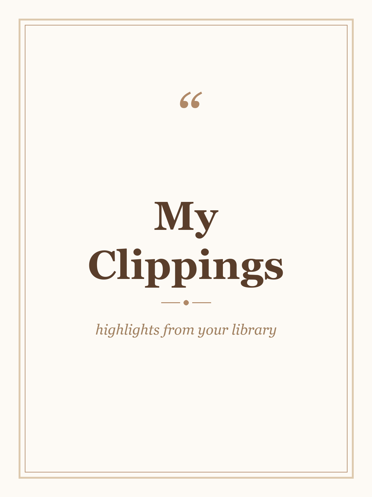
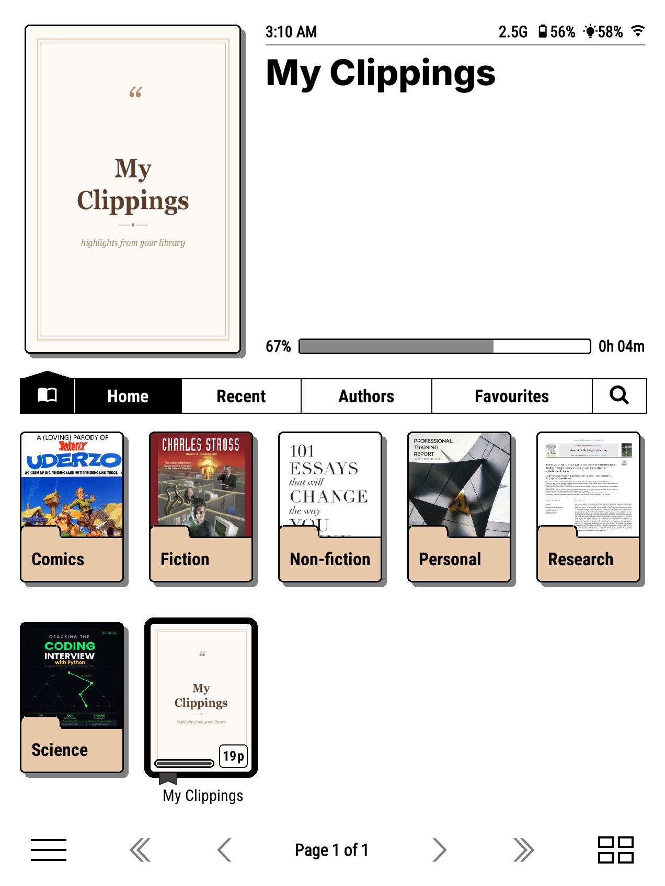

# myclippings.koplugin

Consolidates highlights scattered across your reading setup — KOReader's own
per-book annotations and Kindle's native `My Clippings.txt` — into one
live-updating, nicely formatted **My Clippings.html** file. Every new
highlight you make in KOReader gets appended automatically; a manual "pull"
merges in anything from Kindle's clippings file too.

## Why

If you read across both the stock Kindle app and KOReader, or you've ever
re-exported/re-copied your library and had KOReader lose its `.sdr` sidecar
data, your highlights end up scattered across several places with no single
view of everything. This plugin builds and maintains that single view, and
can (carefully) recover highlights back into a book's real annotations so
they show up in other tools that read native KOReader highlights (e.g. the
`bookshelf.koplugin` quote-of-the-day widget).

## Features

- **Live sync** — hooks KOReader's `AnnotationsModified` event, so every
  highlight you make is appended (debounced) without any manual step.
- **Pull from KOReader** — walks your library's `.sdr` sidecars for existing
  annotations and merges them in.
- **Pull from Kindle** — parses `My Clippings.txt` (the file the stock
  Kindle app maintains) and merges it in too, deduplicated against what's
  already there.
- **Push pending highlights to the open book** — for highlights recovered
  from Kindle Clippings (which have no real position, just a page/location
  number), searches the *currently open* book for the exact text and, if
  found, writes a genuine annotation (real position, real `drawer`) into
  that book's own `.sdr` — indistinguishable from a highlight you made
  natively. Deliberately scoped to the book you have open right now; see
  [Design notes](#design-notes--why-no-bulk-push) for why.
- **Output formatting** — grouped by book or by timeline (your choice),
  each highlight rendered as a styled quote block with a working "Open in
  book" link that jumps to the exact position.
- **Merges overlapping Kindle re-captures** — Kindle sometimes records the
  same passage twice with a slightly different boundary (a character or two
  off at the start/end). On every rebuild, any pair of highlights in the
  same book is automatically collapsed into one whenever at least one side
  came from Kindle and the two texts either contain one another or differ
  by less than ~8%, keeping whichever side has a real position (or the
  longer text if neither does). Two KOReader-native highlights are never
  merged this way, even if their text happens to overlap, since those are
  deliberate.
- **Configurable** — output folder (defaults to your KOReader home folder,
  overridable), font, and grouping mode, all from the plugin's menu.
- **Cover** — the bundled `cover.png` is set as `My Clippings.html`'s custom
  cover automatically the first time it's generated, so it shows up nicely
  in cover-grid views like `bookshelf.koplugin`'s. Pick a different cover
  yourself at any point (e.g. via bookshelf's own cover picker) and it's
  left alone from then on.

Shown in `bookshelf.koplugin`'s home screen, alongside the rest of a library:

## Installation

1. Download or clone this repo so the plugin folder is named
   `myclippings.koplugin`.
2. Copy the whole `myclippings.koplugin` folder into your KOReader plugins
   directory (e.g. `koreader/plugins/`).
3. Restart KOReader. It appears in the main menu under **Tools** (top level,
   not nested under "More tools") as **My Clippings Highlight Sync**.

## Usage

Open **Tools → My Clippings Highlight Sync**:

- **Pull highlights from KOReader** — merge in `.sdr` annotations.
- **Pull highlights from Kindle (My Clippings)** — merge in
  `My Clippings.txt`.
- **Pull and merge highlights from all sources** — runs both pulls, then
  merges/dedupes.
- **Push pending highlights to open book** — only available (and only
  useful) while you have a book open; matches this book's pending
  Kindle-Clippings-sourced highlights against the actual text and writes
  real annotations for whatever matches.
- **Rebuild highlights file now** — regenerates `My Clippings.html`
  immediately (also runs an automatic dedup pass first).
- **Group by: Book / Timeline** — toggles output grouping.
- **Font** — Bookerly, Georgia, PT Serif, or sans-serif.
- **Set custom output folder... / Use default home folder** — where
  `My Clippings.html` is written.

## Design notes / why no bulk push

An earlier version tried to push highlights into *any* matching book in
your library by opening each one headlessly via `DocumentRegistry` and
calling `document:findAllText()`. This reliably segfaulted KOReader (exit
code 139) — confirmed via a standalone `luajit` reproduction outside the
full app, isolating it to `findAllText()` on a document that hasn't gone
through the normal ReaderUI initialization sequence. Opening a document
alone isn't enough; something `findAllText` depends on only gets set up by
the full "show this book in the reader" flow.

The safe alternative implemented here only searches the book you already
have open — since that document went through the normal flow, this uses
the exact same code path KOReader's own in-book search does, with no crash
risk observed. If you want highlights pushed into other books, open them
and run the push from within each one.

## Known limitations

- Kindle Clippings entries with only a `Location` number (no page number,
  common for books without fixed pagination) won't get a jump-link if they
  were never pushed into a real book, since there's nothing reliable to
  link to.
- Overlapping near-duplicates are only merged when at least one side is
  Kindle-sourced (see Features above); two separately-made KOReader
  highlights that happen to overlap are left as-is, since collapsing those
  automatically risks discarding one you meant to keep.

## License

MIT
